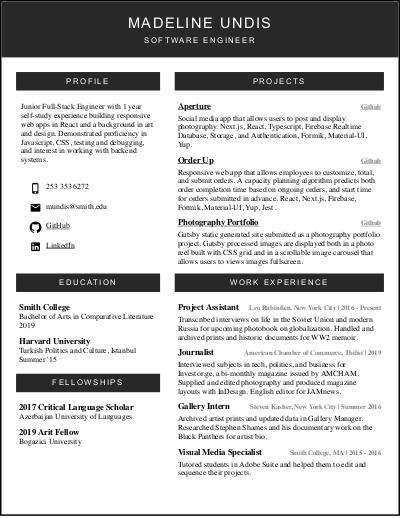
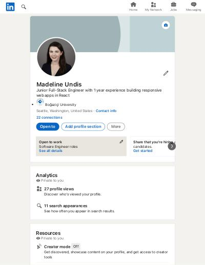

### Hiya. 
I'm a Junior Full-Stack Engineer in the process of studying and looking for work opportunities. 

<html>

<section>

Resume

LinkedIn

</section>
</html>

### Projects

I'm currently building a backend that tracks remote work hours with NestJS, and perfecting a capacity planning algorithm for an [app](https://github.com/magdaundisz/order-up/blob/main/README.md) I built for my work. 

Before software I studied photography and worked as a journalist in Tbilisi, Georgia. Examples of my work can be seen in a [portfolio](https://github.com/magdaundisz/Photography-Portfolio) I built with Gatsby.  

### Languages, Frameworks, and Libraries

<ul>
<li>Javascript</li>  
<li>Typescript (check out my <a href="https://github.com/magdaundisz/aperture">instagram clone</a>)</li>  
<li>React</li>
<li>Next</li>
<li>Material-UI</li>
<li>NestJS</li>
<ul>

 

